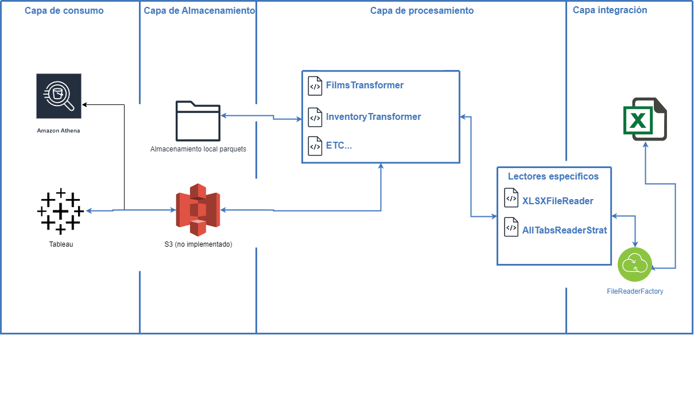

# Proyecto de Pipeline de Datos con Apache Spark y Python

## Descripción General

Este proyecto implementa un pipeline de datos para procesar el archivo `Films2.xlsx`, que contiene el Modelo Entidad-Relación (MER) compuesto por 5 tablas distribuidas en diferentes pestañas. El objetivo es extraer, transformar y cargar (ETL) los datos, asegurando su consistencia y calidad, y prepararlos para su consumo posterior.

---

## Contenido

- [Arquitectura de la Solución](#arquitectura-de-la-solución)
- [Descripción del Pipeline](#descripción-del-pipeline)
- [Implementación Técnica](#implementación-técnica)
  - [Lectura de Datos (Integración)](#lectura-de-datos-integración)
  - [Procesamiento de Datos (Transformación)](#procesamiento-de-datos-transformación)
  - [Almacenamiento de Datos](#almacenamiento-de-datos)
  - [Consumo de Datos](#consumo-de-datos)
- [Patrones de Diseño Utilizados](#patrones-de-diseño-utilizados)
- [Pruebas Unitarias](#pruebas-unitarias)
- [Instrucciones para Ejecutar el Proyecto](#instrucciones-para-ejecutar-el-proyecto)
- [Despliegue en AWS (Opcional)](#despliegue-en-aws-opcional)
- [Conclusiones](#conclusiones)

---

## Arquitectura de la Solución

La solución propuesta se basa en una arquitectura de pipeline de datos que consta de cuatro capas principales:

1. **Integración**: Lectura y extracción de datos desde el archivo `Films2.xlsx`.
2. **Procesamiento**: Limpieza, transformación y validación de los datos utilizando Apache Spark.
3. **Almacenamiento**: Escritura de los datos procesados en formato Parquet para almacenamiento eficiente.
4. **Consumo**: Disponibilidad de los datos procesados para análisis y consultas posteriores.



*Nota: El diagrama de arquitectura muestra el flujo de datos a través de las diferentes capas del pipeline.*

---

## Descripción del Pipeline

El pipeline de datos implementa un proceso ETL completo:

- **Extracción**:
  - Lectura de las 5 tablas desde el archivo `Films2.xlsx`.
  - Utilización de lectores especializados para manejar diferentes formatos y estrategias de lectura.

- **Transformación**:
  - Limpieza de datos inconsistentes o erróneos.
  - Normalización de columnas y tipos de datos.
  - Aplicación de reglas de negocio para validar y corregir información.

- **Carga**:
  - Escritura de los datos transformados en archivos Parquet.
  - Almacenamiento local o en AWS S3 (dependiendo del entorno de ejecución).
  - Inclusión de metadatos como el nombre del archivo fuente, nombre de la tabla y timestamp de procesamiento.

---

## Implementación Técnica

### Lectura de Datos (Integración)

- **Archivo Fuente**: `Films2.xlsx`
- **Lectura de Pestañas**:
  - Se utiliza la clase `XLSXFileReader` para leer todas las pestañas del archivo Excel.
  - Implementa el patrón de diseño *Strategy* para permitir diferentes estrategias de lectura.

### Procesamiento de Datos (Transformación)

- **Limpieza y Transformación**:
  - Se desarrollaron clases transformadoras específicas para cada tabla (`FilmsTransformer`, `InventoryTransformer`, etc.).
  - Cada transformador hereda de `BaseTransformer` y sobreescribe el método `transform`.
  - Se aplican las siguientes transformaciones:
    - Renombrado de columnas para estandarización.
    - Conversión de tipos de datos.
    - Limpieza de valores nulos o inconsistentes.
    - Validación y corrección de correos electrónicos y nombres.
    - Formateo de fechas y eliminación de valores mal formateados.
  - Se incluyen metadatos adicionales como el nombre del archivo fuente y timestamp de procesamiento.

### Almacenamiento de Datos

- **Formato de Almacenamiento**: Parquet
  - Elegido por su eficiencia en la compresión y lectura de datos.
- **Ubicación de Almacenamiento**:
  - **Local**: Los archivos Parquet se almacenan en `data/processed_data/` para pruebas locales y unitarias.
  - **AWS S3 (Opcional)**: Para despliegue en producción, los archivos pueden almacenarse en un bucket de S3.
- **Escritura de Datos**:
  - Se implementa el método `write_to_parquet` en `BaseTransformer`.
  - Los datos transformados se escriben en la ubicación especificada, incluyendo los metadatos.

### Consumo de Datos

- Los datos almacenados en formato Parquet pueden ser consumidos por diversas herramientas de análisis.
- **Integración con AWS**:
  - Servicios como AWS Athena o Redshift Spectrum pueden utilizarse para consultar los datos almacenados en S3.

---

## Patrones de Diseño Utilizados

1. **Factory Method (Método Fábrica)**:
   - Implementado en `FileReaderFactory` para instanciar el lector adecuado según el tipo de archivo.

2. **Strategy Pattern (Patrón Estrategia)**:
   - Utilizado en la lectura de pestañas del archivo Excel, permitiendo cambiar la estrategia de lectura en tiempo de ejecución.

3. **Template Method Pattern (Patrón Método Plantilla)**:
   - La clase `BaseTransformer` define la estructura general del proceso de transformación, y las subclases implementan los detalles específicos.

4. **Singleton Pattern (Patrón Singleton)**:
   - Implementado en `SparkSessionManager` para asegurar que solo haya una instancia de `SparkSession` en toda la aplicación.

---

## Pruebas Unitarias

- Se crearon pruebas unitarias en el archivo `test_data_validation.py` dentro de la carpeta `tests/`.
- **Objetivo de las Pruebas**:
  - Verificar la correcta transformación y limpieza de los datos.
  - Asegurar que los datos cumplen con los criterios de calidad establecidos.
- **Aspectos Validados**:
  - Formato de fechas en columnas clave.
  - Valores numéricos en columnas de identificadores.
  - Validez de correos electrónicos.
  - Consistencia en nombres y apellidos.
- **Ejecución de Pruebas**:
  - Las pruebas pueden ejecutarse con el comando:
    ```
    python -m unittest discover -s tests
    ```

---

## Instrucciones para Ejecutar el Proyecto

### Requisitos Previos

- **Python 3.11+**
- **Apache Spark 3.x**
- **Java 8 o 11**

### Instalación de Dependencias

1. Crear un entorno virtual:
   ```
   python -m venv venv
   ```
2. Activar el entorno virtual:
   - En Windows:
     ```
     venv\Scripts\activate
     ```
   - En Unix o MacOS:
     ```
     source venv/bin/activate
     ```
3. Instalar las dependencias:
   ```
   pip install -r requirements.txt
   ```

### Ejecución del Pipeline

1. Colocar el archivo `Films2.xlsx` en la carpeta `data/`.
2. Ejecutar el script principal:
   ```
   python src/main.py
   ```
3. Los archivos Parquet procesados se guardarán en `data/processed_data/`.

### Ejecución de Pruebas Unitarias

1. Asegurarse de haber ejecutado el pipeline para generar los archivos Parquet.
2. Ejecutar las pruebas:
   ```
   python -m unittest discover -s tests
   ```

---

## Despliegue en AWS (Opcional)

Para desplegar el pipeline en AWS y almacenar los datos procesados en S3:

1. Configurar las credenciales de AWS utilizando IAM roles o variables de entorno.
2. Modificar el archivo `main.py` para incluir la configuración de AWS S3 en `SparkSession`:
   ```python
   spark = SparkSession.builder \
       .appName("DataPipelineApp") \
       .config("spark.hadoop.fs.s3a.access.key", "<YOUR_AWS_ACCESS_KEY>") \
       .config("spark.hadoop.fs.s3a.secret.key", "<YOUR_AWS_SECRET_KEY>") \
       .config("spark.hadoop.fs.s3a.endpoint", "s3.amazonaws.com") \
       .getOrCreate()
   ```
3. Cambiar las rutas de salida para que apunten al bucket de S3 deseado:
   ```python
   output_path = f"s3a://your-bucket-name/processed_data/{sheet_name}"
   ```
4. Ejecutar el script en un entorno compatible, como una instancia EC2 o EMR.

Este paso no se hizo por falta de capa gratuita con S3.

---

## Conclusiones

Este proyecto cumple con los requisitos establecidos en la prueba técnica:

1. **Desarrollo de Diagramas de Arquitectura**: Se proporcionó un diagrama que muestra la arquitectura del pipeline de datos.

2. **Implementación de ETL con Python y Apache Spark**: Se desarrolló un pipeline ETL utilizando Python y Apache Spark para procesar los datos de `Films2.xlsx`.

3. **Capas del Pipeline**: El pipeline está compuesto por las capas de integración, almacenamiento, procesamiento y consumo.

4. **Programación Orientada a Objetos**: El código se desarrolló siguiendo el paradigma de programación orientada a objetos, con clases y métodos que encapsulan la funcionalidad.

5. **Patrones de Diseño**: Se implementaron varios patrones de diseño, incluyendo Factory Method, Strategy, Template Method y Singleton.

6. **Despliegue en AWS (Opcional)**: No se hizo un despliegue pero quedaron listos los archivos parquet que serían funcionales en un gestor como S3.

7. **Verificación y Limpieza de Datos**: Se incluyó un proceso de validación y limpieza de datos para asegurar su consistencia y calidad.

---

## Preguntas Relevantes

Basado en los datos procesados, se pueden formular y responder preguntas como:

- **¿Cuáles son las películas más rentadas y qué características tienen?**
- **¿Cuál es el comportamiento de alquiler por segmento de clientes?**
- **¿Qué tiendas tienen el mayor volumen de inventario y ventas?**
- **¿Existe alguna correlación entre la duración de las películas y su popularidad?**

Estas preguntas pueden ser exploradas utilizando los datos procesados y herramientas de análisis adicionales.

---

## Contacto

github.com/jumcorrealom

---

¡Gracias por revisar este proyecto!